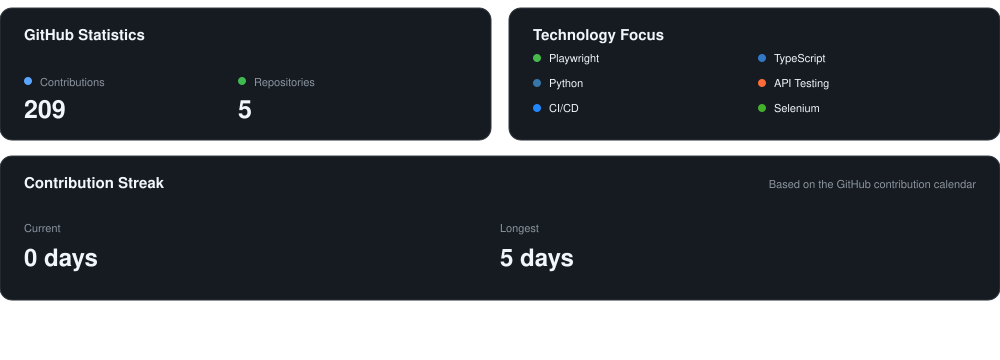

# M. Haris B. Satriyo

### QA Engineer · Test Automation · Quality Engineering

**Building reliable software through automation, thoughtful testing, and continuous feedback.**

<!-- [](https://twitter.com/haris_satriyo)
[](https://www.instagram.com/mhb.satriyo) -->
[](https://www.instagram.com/mhb.satriyo) 
&nbsp;&nbsp;
[](https://twitter.com/haris_satriyo)


## Technology Stack

<div align="center">

### Automation


### API · CI/CD · Reporting


</div>


## GitHub Activity




## Currently Building

<table style="width: 100%; table-layout: fixed;">
<tr>
<th style="width: 50%; text-align: left;">Test Automation</th>
<th style="width: 50%; text-align: left;">Quality Engineering</th>
</tr>
<tr>
<td valign="top">

Designing maintainable automation frameworks with:

- Playwright
- Python
- TypeScript
- Page Object Model
- Authentication & session management
- Cross-browser execution

</td>
<td valign="top">

Building confidence across the software lifecycle through:

- E2E testing
- API testing
- Smoke & regression testing
- CI/CD automation
- Allure reporting
- Test reliability & maintainability

</td>
</tr>
</table>

## Automation Approach

<div align="center">

**Reliable**

↓

**Maintainable**

↓

**Meaningful Coverage**

↓

**Fast Feedback**

↓

**Continuous Improvement**

</div>


## What I'm Exploring

```text
Playwright Architecture
        │
        ├── Scalable test design
        ├── API automation
        ├── Authentication & session strategies
        ├── CI/CD orchestration
        └── Test reliability & flakiness reduction
```


<details>
<summary><strong>More About My Engineering Focus</strong></summary>

<br>

My primary focus is Software Quality Assurance and Test Automation.

I am particularly interested in the engineering side of testing: designing automation frameworks, reducing duplication, improving test reliability, integrating automated tests into CI/CD pipelines, and making test results useful to the wider development team.

My current technical direction is centered around **Playwright + Python**, while maintaining experience with TypeScript, Selenium, API testing, and modern development tooling.

</details>

---

<div align="center">

### Let's build better software.

<a href="https://www.linkedin.com/in/haris-satriyo/">
  
</a>

<br>
<br>

<sub>Quality is not a final checkpoint. It is part of how great feature is built.</sub>

</div>
